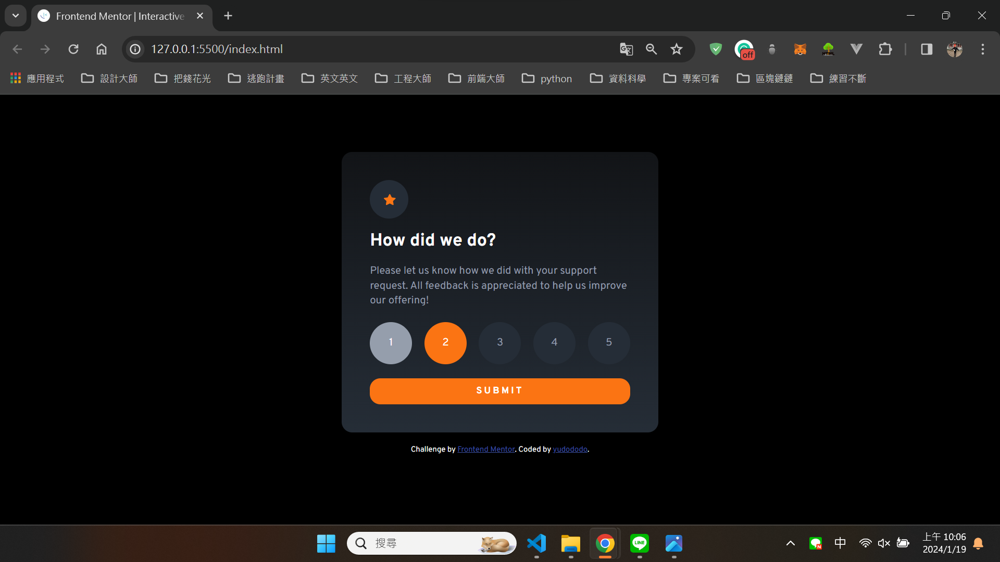
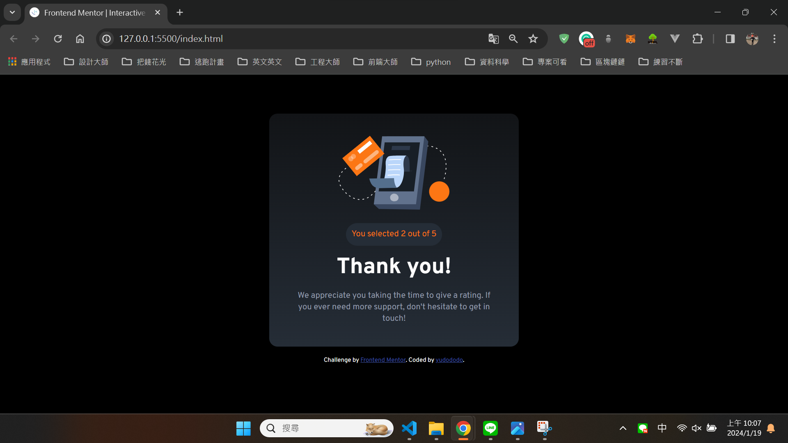
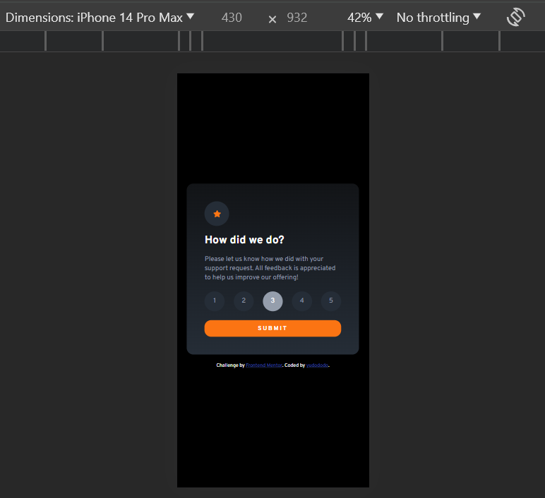
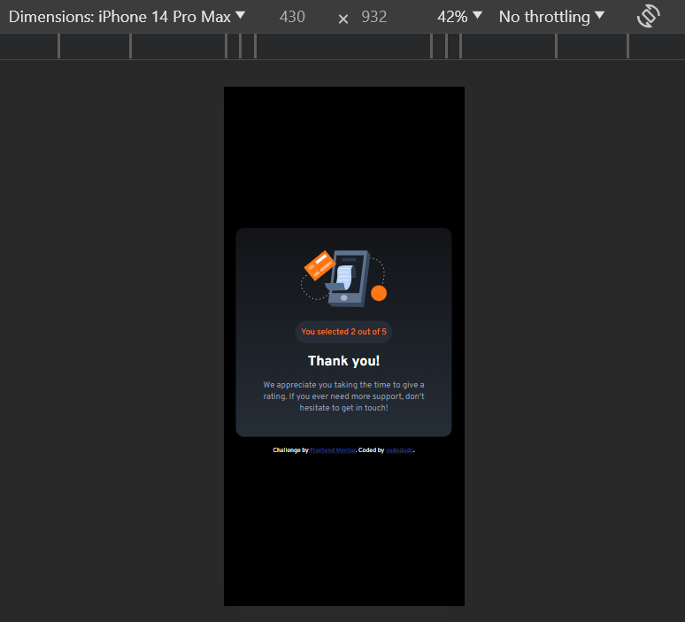

## Overview👀

Hello visitors, I created this github repo to help me practice and showcase my not so refined html and css skill.
Hope that you get a grasp of my current front end skills and help me improve what I lack by sending feedbacks.🙏🙏🙏 
https://yudododo.github.io/interactive-rating-component-main-yu/

## Screenshot🐻💥

## The challenge🔥

Users should be able to:

- View the optimal layout for the app depending on their device's screen size
- See hover states for all interactive elements on the page
- Select and submit a number rating
- See the "Thank you" card state after submitting a rating

## What I learned💪

Adding multiple pages with a single HTML document

## Author🐶

- Frontend Mentor - [@yudododo](https://www.frontendmentor.io/profile/yudododo)
- Instagram - [@yu_dododo](https://www.instagram.com/yu_dododo/)
